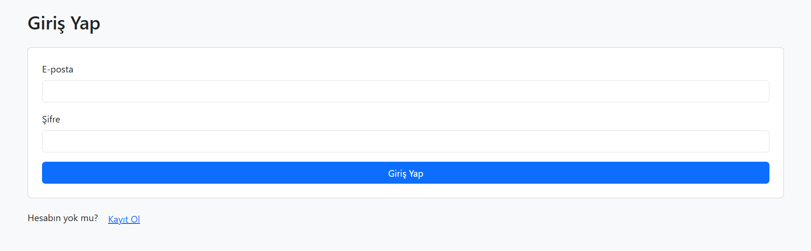

# 🏋️ Spor Takip Sistemi

Bu proje, **Bursa Teknik Üniversitesi - Web Tabanlı Programlama** dersi kapsamında geliştirilmiştir. Kullanıcılar sisteme kayıt olabilir, giriş yapabilir ve günlük yaptıkları sporları kaydedebilir, listeleyebilir, güncelleyebilir ve silebilir.

---

## 🚀 Özellikler

- 🔐 Kullanıcı Kaydı (Şifreler hash'li şekilde veritabanında saklanır)
- 🔑 Giriş / Oturum Açma (PHP `session` ile)
- ➕ Spor Verisi Ekleme (Tarih, tür, süre, tekrar, not)
- 📋 Kayıtları Listeleme
- ✏️ Kayıt Güncelleme
- 🗑️ Kayıt Silme
- 🎨 Bootstrap ile responsive arayüz
- 🔁 Canlı sunucuda çalışır

---

## 🧰 Kullanılan Teknolojiler

| Teknoloji     | Açıklama                     |
|---------------|------------------------------|
| **PHP**       | Backend kodlama (Yalın PHP)  |
| **MySQL / MariaDB** | Veritabanı yönetimi           |
| **Bootstrap 5** | CSS framework (arayüz düzeni) |
| **FileZilla**  | FTP üzerinden sunucuya dosya aktarımı |
| **phpMyAdmin** | Veritabanı tabloları ve yönetimi |

---

## 🗂️ Veritabanı Yapısı

### `users` tablosu:
- `id`, `username`, `email`, `password_hash`

### `workouts` tablosu:
- `id`, `user_id`, `date`, `exercise_type`, `duration_minutes`, `repetitions`, `notes`

---

## 📸 Ekran Görüntüleri

> Aşağıdaki görseller kullanıcı deneyimini göstermektedir.

| Kayıt Ekranı             | Spor Ekleme Formu         |
|--------------------------|---------------------------|
|  |  |

| Listeleme Sayfası        | Giriş Ekranı              |
|--------------------------|---------------------------|
|  |  |

---

## 🌐 Canlı Demo

🔗 [Canlı siteye gitmek için tıklayın](http://95.130.171.20/~st23360859024/php_proje/login.php)

---

## 🎥 Demo Videosu

📺 [YouTube Video Linki]()

---

## ⚠️ Uyarılar

- `.htaccess`, harici PHP kütüphaneleri veya frameworkler kullanılmamıştır.
- `config.php` dosyasında gizli bilgiler yer almamaktadır.
- Veritabanı bağlantısı `PDO` üzerinden yapılmıştır.

---

